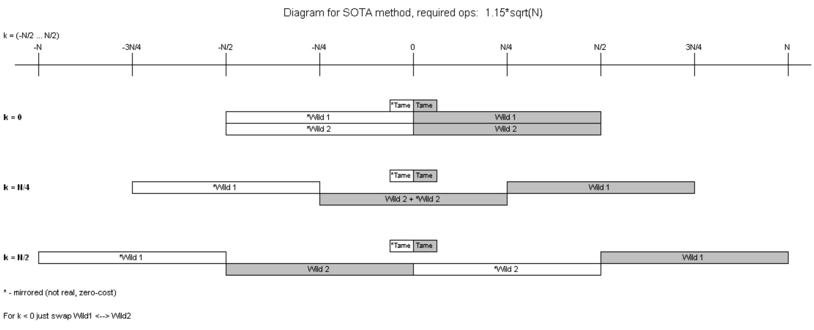
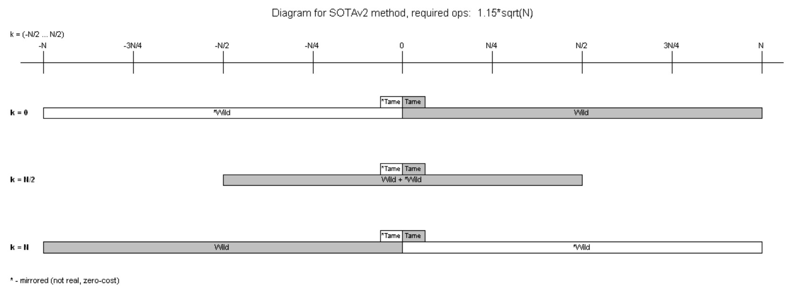

PART 1

Discussion thread: https://bitcointalk.org/index.php?topic=5517607

This software demonstrates various ways to solve the ECDLP using Kangaroos.
The required number of operations is approximately K * sqrt(range), where K is a coefficient that depends on the method used.
This software demonstrates five methods:

1 - Classic. The simplest method. There are two groups of kangaroos: tame and wild. 
As soon as a collision between any tame and wild kangaroos happens, the ECDLP is solved.
In practice, K is approximately 2.1 for this method.

2 - 3-way. A more advanced method. There are three groups of kangaroos: tame, wild1, and wild2. 
As soon as a collision happens between any two types of kangaroos, the ECDLP is solved.
In practice, K is approximately 1.6 for this method.

3 - Mirror. This method uses two groups of kangaroos and the symmetry of the elliptic curve to improve K. 
Another trick is to reduce the range for wild kangaroos.
In practice, K is approximately 1.3 for this method.
The main issue with this method is that the kangaroos loop continuously.

4 - SOTAv1 (check old versions to see it). This method uses three groups of kangaroos and the symmetry of the elliptic curve.
In practice, K is approximately 1.15 for this method. The main issue is the same as in the Mirror method.
I couldn’t find any papers about this method, so let's assume that I invented it :)
See "diagram.jpg" for details. Also there are several other good option sets, one of them is used in the application by default, check the sources. 

5 - SOTAv2 (new). This method has same K=1.15 but uses only two groups of kangaroos and the symmetry of the elliptic curve.

6 - SOTA+. This method is the same as SOTA, but also uses cheap second point. 
When we calculate "NextPoint = PreviousPoint + JumpPoint" we can also quickly calculate "PreviousPoint - JumpPoint" because inversion is the same. 
If inversion calculation takes a lot of time, this second point is cheap for us and we can use it to improve K. 
Using cheap point costs only (1MUL+1SQR)/2. K is approximately 1.02 for this method (assuming cheap point is free and not counted as 1op). 
Or you can pay 1MUL+1SQR and get K about 0.99 (preferable for GPU implementation). 
Or you can pay only (1MUL+1SQR)/4 and get K about 1.05.
Again, I couldn’t find any papers about this method applied to Kangaroo, so let's assume that I invented it. 

Important note: this software handles kangaroo looping in a very simple way, this method is bad for high ranges. 
Next part will demonstrate a good way to handle loops.

